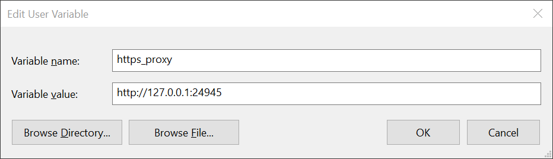
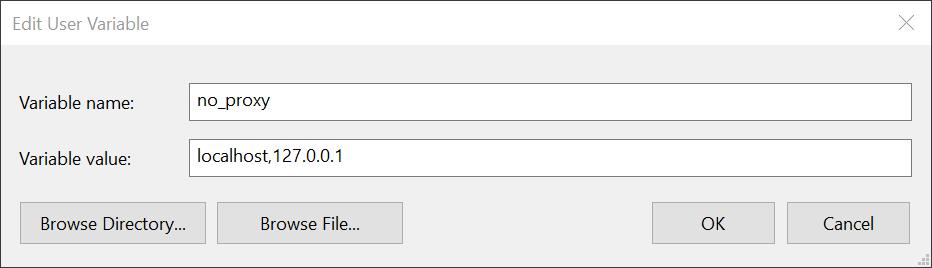

pacproxy
========

[](https://travis-ci.org/williambailey/pacproxy)

A no-frills local HTTP proxy server powered by a [proxy auto-config (PAC) file](https://web.archive.org/web/20070602031929/http://wp.netscape.com/eng/mozilla/2.0/relnotes/demo/proxy-live.html). Especially handy when you are working in an environment with many different proxy servers and your applications don't support proxy auto-configuration.

```
$ ./pacproxy -h
pacproxy v2.0.6

A no-frills local HTTP proxy server powered by a proxy auto-config (PAC) file
https://github.com/williambailey/pacproxy

Usage:
  -c string
        PAC file name, url or javascript to use (required)
  -l string
        Interface and port to listen on (default "127.0.0.1:8080")
  -s string
        Scheme to use for the URL passed to FindProxyForURL
  -v    send verbose output to STDERR
```

```bash
# shell 1
pacproxy -l 127.0.0.1:8080 -s http -c 'function FindProxyForURL(url, host){ console.log("hello pac world!"); return "PROXY random.example.com:8080"; }'
# shell 2
pacproxy -l 127.0.0.1:8443 -s https -c 'function FindProxyForURL(url, host){ console.log("hello pac world!"); return "PROXY random.example.com:8080"; }'
# shell 3
export http_proxy="127.0.0.1:8080"
export https_proxy="127.0.0.1:8443"
curl -I "http://www.example.com"
curl -I "https://www.example.com"
```

## Using pacproxy as a Windows Service

ℹ️ The commands in this section should be executed with PowerShell.

1. Configure `http_proxy` and `https_proxy` in the **Environment Variables** control panel (also optionally `no_proxy`)






Here are the values used in this example:

```
http_proxy = http://127.0.0.1:24944
https_proxy = http://127.0.0.1:24945
no_proxy = localhost,127.0.0.1
```

2. Install the `pacproxy.exe` binary

   ```powershell
   go install
   ```

3. Ensure that the `pacproxy.exe` binary has been successfully installed by checking the contents of the `$GOPATH\bin` directory:

   ```powerhell
   dir "$(go env GOPATH)\bin"
   ```

4. In an administrator PowerShell, create two Windows Services with [NSSM](https://nssm.cc/)

   ```powershell
   $appDir = "$(go env GOPATH)\bin"
   $pacUrl = Get-ItemPropertyValue "HKCU:\Software\Microsoft\Windows\CurrentVersion\Internet Settings" "AutoConfigURL"
   ```

   For http:

   ```powershell
   nssm install PacProxyHttpSvc "$appDir\pacproxy.exe"
   nssm set PacProxyHttpSvc AppParameters "-l 127.0.0.1:24944 -s http -c $pacUrl -v"
   nssm set PacProxyHttpSvc AppDirectory "$appDir"
   nssm set PacProxyHttpSvc AppStderr "$appDir\pacproxy_http.log"
   nssm set PacProxyHttpSvc DisplayName "PAC Proxy for HTTP requests"
   nssm set PacProxyHttpSvc Description "HTTP proxy server running on 127.0.0.1:24944 for applications that don't support proxy auto-configuration"
   nssm start PacProxyHttpSvc
   ```
   
   For https:
   
   ```powershell
   nssm install PacProxyHttpsSvc "$appDir\pacproxy.exe"
   nssm set PacProxyHttpsSvc AppParameters "-l 127.0.0.1:24945 -s https -c $pacUrl -v"
   nssm set PacProxyHttpsSvc AppDirectory "$appDir"
   nssm set PacProxyHttpsSvc AppStderr "$appDir\pacproxy_https.log"
   nssm set PacProxyHttpsSvc DisplayName "PAC Proxy for HTTPS requests"
   nssm set PacProxyHttpsSvc Description "HTTPS proxy server running on 127.0.0.1:24945 for applications that don't support proxy auto-configuration"
   nssm start PacProxyHttpsSvc
   ```

## License

> Copyright 2020 William Bailey
>
> Licensed under the Apache License, Version 2.0 (the "License");
> you may not use this file except in compliance with the License.
> You may obtain a copy of the License at
>
>     http://www.apache.org/licenses/LICENSE-2.0
>
> Unless required by applicable law or agreed to in writing, software
> distributed under the License is distributed on an "AS IS" BASIS,
> WITHOUT WARRANTIES OR CONDITIONS OF ANY KIND, either express or implied.
> See the License for the specific language governing permissions and
> limitations under the License.
